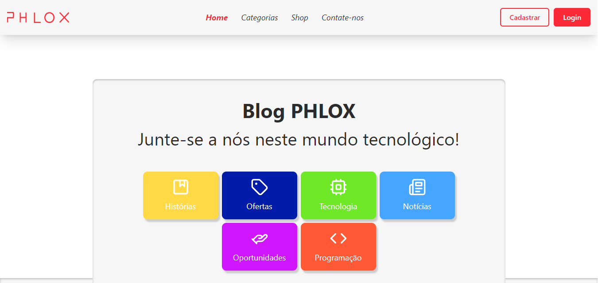

# [PHLOX Blog](https://phlox-blog.vercel.app/)
[](https://phlox-blog.vercel.app/)

## Sobre ✏️
### Este projeto é um blog de uma empresa fictícia de tecnologia, onde além da própria poder postar o conteúdo da loja, também funciona como uma rede social onde os clientes podem interagir se tiverem uma conta.

## Tecnologias 💻
<div>
  <abbr title="React - Framework Javascript" >
    
  </abbr>
  <abbr title="Vite - Framework Javascript" >
    
  </abbr>
  <abbr title="Typescript - Linguagem fortemente tipada">
    
  </abbr>
</div>

## Bibliotecas 📚
<div>
  <abbr title="Next UI - Biblioteca de componentes (Design System)">
    
  </abbr>
  <abbr title="DaisyUI - Biblioteca de componentes (Design System)">
    
  </abbr>
  <abbr title="Tailwind CSS - Biblioteca de estilização">
    
  </abbr>
  <abbr title="Styled Components - Biblioteca para fazer componentes estilizados" >
    
  </abbr>
  <abbr title="Lucide - Biblioteca de ícones">
    
  </abbr>
  <abbr title="Recoil - Biblioteca de gerenciamento de estados">
    
  </abbr>
  <abbr title="React Router Dom - Biblioteca para criar rotas">
    
  </abbr>
  <abbr title="Markdown-To-Jsx - Biblioteca para renderizar markdown como componentes">
    
  </abbr>
</div>

## Serviço Backend 📥
<div>
  <abbr title="Firebase - Plataforma backend para guardar informações">
    
  </abbr>
</div>

## Estrutura principal do Projeto 🗃️
```plaintext
src
├── components/
│   └── ...
├── data/
│   └── ...
├── interfaces/
│   └── ...
├── pages/
│   └── ...
├── state/
│   ├── hooks
│   │   └── ...
│   └── atom.ts
├── styles/
│   └── ...
├── utils/
│   ├── firebase
│   │   ├── functions
│   │   │   └── ...
│   │   └── firebase.ts
│   └── ...
├── index.css
├── main.tsx
├── routes.tsx
└── vite-env.d.ts
```
### Descrição:
- src - Pasta raíz da aplicação;
- components - Ficam os componentes;
- data - Ficam os dados básicos, que são usados por um ou mais componentes;
- interfaces - Ficam as interfaces, que definem a estrutura dos dados;
- pages - Ficam as páginas, que são as rotas principais, como a tela de login, home etc;
- state - Ficam os estados globais, definidos em atom.ts, e na pasta hook, ficam os hooks personalizados, usados para obter ou definir um estado;
- styles - Ficam as definições de estilo usadas em toda a aplicação, como as variáveis e os componentes estilizados;
- utils - Ficam funções comuns que são utilizadas em toda a aplicação, e na pasta firebase ficam as que são relacionadas ao firebase, que são guardadas na subpasta functions, e em firebase.ts, a conexão com o firebase e seus serviços;
- index.css - Arquivo padrão do React, ficam os estilos css globais;
- main.tsx - Arquivo padrão do React, fica o componente principal que vai ser carregado;

## Rodando Localmente (Prompt) 📟
### Clone o projeto
```bash
  git clone https://github.com/Paulo-Mikhael/phlox-blog
```
### Entre no diretório do projeto
```bash
  cd phlox-blog
```
### Entre no diretório do projeto
```bash
  cd phlox-blog
```
### Instale as dependências
```bash
  npm install
```
### Criar um projeto Firebase com as funções 'Authentication' e 'Realtime Database', e conectar à aplicação rodando o comando abaixo e seguindo as instruções dadas [(Documentação de Auxílio)](https://firebase.google.com/docs/cli?hl=pt-br#initialize_a_firebase_project)
```bash
  firebase init
```
### Colocar as configs do seu projeto Firebase nesta variável de ambiente no arquivo .env na raíz do projeto
```bash
  VITE_FIREBASE_CONFIG='{
  "apiKey": "Sua API key",
  "authDomain": "Dominío do projeto",
  "projectId": "ID do projeto",
  //... outras configurações
  "databaseURL": "URL do Realtime Database do projeto"
}'
```
### Inicie o servidor
```bash
  npm run dev
```

## Talvez você queira ver 💡
  ### [Portifólio](https://portifolio-react-three.vercel.app/)
  ### [Currículo](https://docs.google.com/document/d/1xhimUtV6EM7c1GtwBwAHsIonX1HjoLSi/edit)

## Confira meus outros projetos 🛠️
  - [in.orbit (front-end) - Aplicação de metas pessoais](https://github.com/Paulo-Mikhael/in-orbit-frontend?tab=readme-ov-file#readme)
  - [in.orbit (back-end) - API de metas](https://github.com/Paulo-Mikhael/in-orbit-backend?tab=readme-ov-file#readme)
  - [Fastask - Gerenciador de Tarefas](https://github.com/Paulo-Mikhael/fastask?tab=readme-ov-file#readme)
  - [Landing Page para uma academia](https://github.com/Paulo-Mikhael/academia-landing-page?tab=readme-ov-file#readme)
  - [Landing Page para um e-commerce de tech](https://github.com/Paulo-Mikhael/phlox?tab=readme-ov-file#readme)
  - [Landing Page para um e-commerce de plantas](https://github.com/Paulo-Mikhael/casa-verde?tab=readme-ov-file#readme)

## Contatos 📞
  [](https://portifolio-react-three.vercel.app/contacts)
  [](https://www.linkedin.com/in/paulo-miguel-4b706022b/)
  [](https://www.instagram.com/pa__miguel?igsh=MWxoYzdqNGluZWcyaA%3D%3D)
  [](https://api.whatsapp.com/send/?phone=5592992813253&text=Ol%C3%A1%21+Gostaria+de+fazer+uma+oferta...&type=phone_number&app_absent=0)